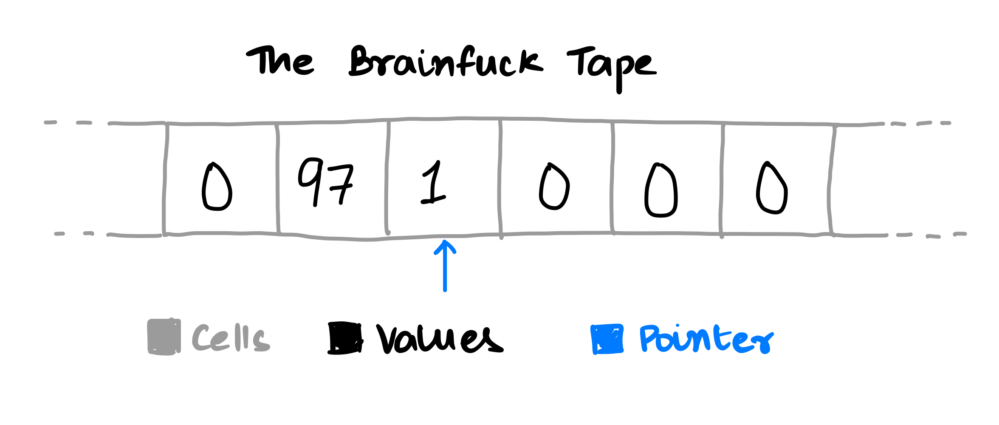

# Brainfuck

[Brainfuck](https://no.wikipedia.org/wiki/Brainfuck) er et minimalistisk programmeringsspråk bestående av 8 tegn.

Lag et program som tolker Brainfuck-kode og bruker standard input og output.

## Om språket



Brainfuck opererer på en virtuell sekvens av celler. Den har en peker som flytter frem og tilbake og kan lese/skrive til cellene. Brainfuck-kode består av de følgende 8 tegnene:

|Tegn|Mening|
|---|---| 
|> | øk pekeren (til å peke på nærmeste celle til høyre).|
|< | minsk pekeren (til å peke på nærmeste celle til venstre).|
|+ | øk (med én) byten på pekeren.|
|- | minsk (med én) byten på pekeren.|
|. | skriv ut byten på pekeren.|
|, | aksepter én byte med inndata og lagre den i byten på pekeren.|
|[ | hopp forover til kommandoen etter den tilhørende ] hvis byten på pekeren er null.|
|] | hopp tilbake til kommandoen etter den tilhørende [ hvis byten på pekeren ikke er null. |

Tegn som ikke er disse 8 tolkes som kommentarer.

## "Hallo verden!"
Dette programmet skriver "Hallo verden!\n" til stdout.
```brainfuck
++++++++++
[
   >+++++++>++++++++++>+++>+<<<<-
]
>++. print 'H'
>---. print 'a'
+++++++++++. 'l'
. 'l'
+++. 'o'
>++. mellomrom
<<++++++++++++++. 'V'
>----------. 'e'
+++++++++++++. 'r'
--------------. 'd'
+. 'e'
+++++++++. 'n'
>+. '!'
>. newline
```
## Ekstra utfordring: Løs én av de andre oppgavene i Brainfuck
Brainfuck er turing-komplett, så i teorien er alle løsbare :)